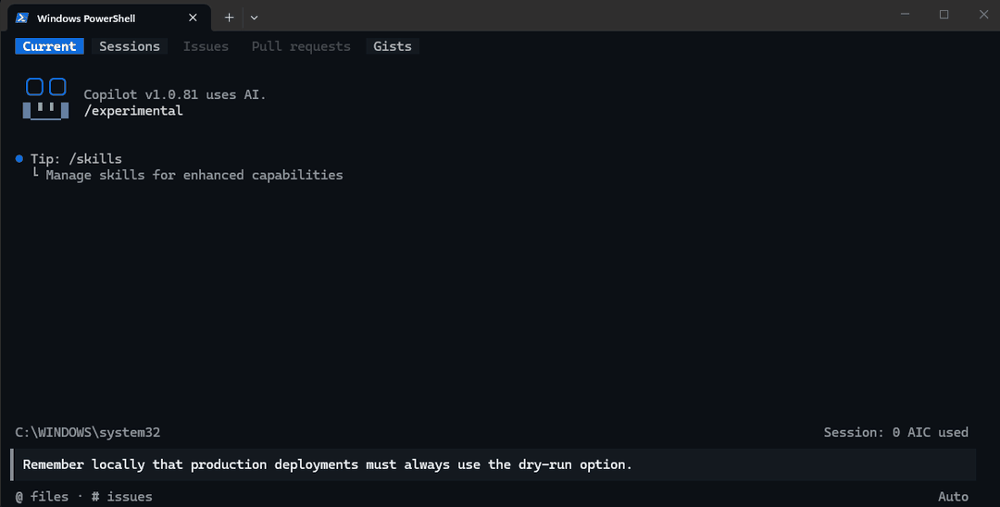
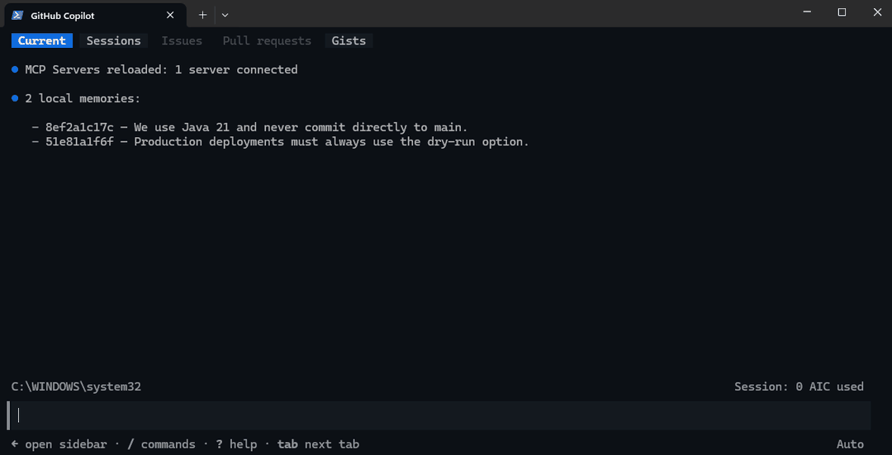
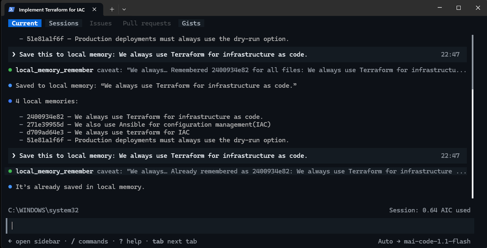
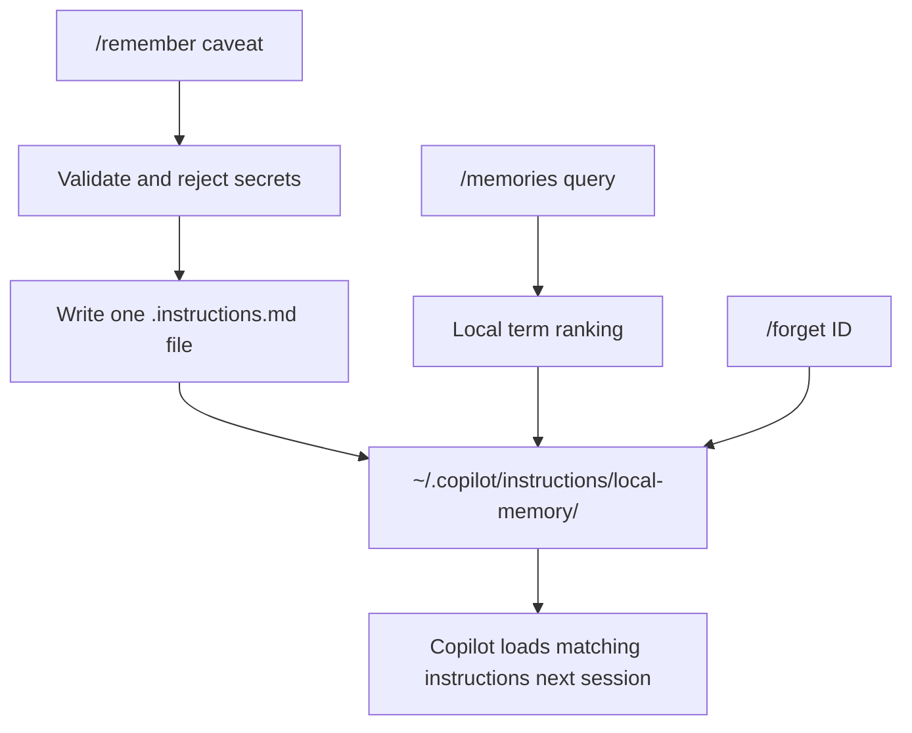

# Copilot CLI Local Memory

**Give GitHub Copilot CLI a memory you own.**

[](LICENSE)
[](package.json)
[](https://github.com/shankarnarayanb/copilot-cli-local-memory/actions/workflows/test.yml)

Local, persistent, human-readable memory with explicit commands and no server,
database, telemetry, or network calls.

<p align="center">
  
</p>

Memories are plain Markdown files you can inspect, edit, back up, or delete.
It is especially useful when your organisation disables GitHub's managed
Copilot Memory but still permits local extensions and custom instructions.

> [!IMPORTANT]
> `/memory` (singular) is GitHub's built-in command and only accepts
> `on`, `off`, or `show`. This extension uses `/memories` (plural) to list or
> search locally stored caveats.

## Quick start

Requires GitHub Copilot CLI with plugin support, experimental extensions enabled,
and Node.js 20 or newer.

### Install as a Copilot CLI plugin

```text
copilot plugin install shankarnarayanb/copilot-cli-local-memory
copilot --experimental
```

The plugin bundles the extension directly. There is no separate `npm install`,
database, server, or runtime dependency to configure.

Inside Copilot CLI, confirm that both the plugin and extension are available:

```text
/plugin list
/extensions manage
```

Then save your first caveat:

```text
/remember When the Saviynt access token expires, refresh it once and retry.
/memories Saviynt
```

### Upgrading from the v1.0 script installer

Remove the old extension copy before installing the plugin so Copilot does not
load the same commands twice. The uninstall script keeps your saved memories.

Windows PowerShell:

```powershell
powershell -ExecutionPolicy Bypass -File ./uninstall.ps1
copilot plugin install shankarnarayanb/copilot-cli-local-memory
```

macOS or Linux:

```bash
sh uninstall.sh
copilot plugin install shankarnarayanb/copilot-cli-local-memory
```

### Legacy script installation

If your Copilot CLI version does not yet support plugins, the original scripts
can still place the extension in Copilot's documented user extension directory.

### macOS or Linux

```bash
git clone https://github.com/shankarnarayanb/copilot-cli-local-memory.git
cd copilot-cli-local-memory
sh install.sh
copilot --experimental
```

### Windows PowerShell

```powershell
git clone https://github.com/shankarnarayanb/copilot-cli-local-memory.git
Set-Location copilot-cli-local-memory
powershell -ExecutionPolicy Bypass -File ./install.ps1
copilot --experimental
```

Inside Copilot CLI, confirm that the extension is running:

```text
/extensions manage
```

The installer copies only `extension.mjs` and `memory-store.mjs` to
`~/.copilot/extensions/local-memory/`. It respects `COPILOT_HOME` when that
environment variable is set and backs up an existing installation before
replacing it.

## Commands

| Command | What it does |
|---|---|
| `/remember <caveat>` | Saves a caveat for future sessions |
| `/remember --scope "src/**/*.ts" <caveat>` | Saves a caveat for matching files only |
| `/memories` | Lists all local memories |
| `/memories <search>` | Finds memories by ID, text, or file scope |
| `/forget <ID>` | Deletes one exact memory |
| `/forget <unique text>` | Deletes a memory only when the text identifies one result |

Examples:

```text
/remember Always run deploy-tool with --dry-run before production.
/remember For acme-api, a 404 may mean propagation is incomplete; retry once.
/remember --scope "src/**/*.ts" Use Zod rather than Joi for validation.

/memories
/memories deploy-tool

/forget a1b2c3d4e5
```

<p align="center">
  
</p>

You can also ask Copilot naturally:

```text
Save this caveat to local memory: run deploy-tool with --dry-run first.
Check local memory for caveats about deploy-tool.
```

Natural-language requests use the extension tools
`local_memory_remember` and `local_memory_recall`. Copilot decides whether to
call a tool and may ask for permission. Use the slash commands when you want
deterministic behaviour.

After `/remember` or `/forget`, start a new session with `/new` before relying
on automatic instruction loading. The command result is immediate, but Copilot
CLI loads custom instructions when a session starts.

## Safe by default

Equivalent memories are stored only once. Repeating the same save request
returns the existing memory ID instead of creating another file. Deletion by
text is also ambiguity-safe: when several entries match, `/forget` asks you to
choose an exact ID.

<p align="center">
  
</p>

## How it works



Every caveat is stored as a separate modular custom-instruction file:

```text
~/.copilot/instructions/local-memory/*.instructions.md
```

If `COPILOT_HOME` is set, the files are stored beneath that directory instead.
A generated file looks like this:

```markdown
---
applyTo: "**"
---
<!-- copilot-local-memory {"id":"c440aa82dd", ...} -->

When the Saviynt access token expires, refresh it once and retry.
```

The `applyTo` glob lets Copilot load a rule only for relevant files. Explicit
search uses deterministic term ranking: there are no embeddings, external
services, background processes, or hidden databases. Deletion is ambiguity-safe;
if text matches more than one entry, nothing is deleted until you supply an ID.

This does not imitate or bypass GitHub's server-side Memory service. It combines
two documented Copilot CLI mechanisms: user extensions provide commands and
tools, while modular custom instructions provide cross-session context.

## Where your data goes

The extension itself is offline and makes no network calls. However, when a
stored instruction applies, GitHub Copilot CLI can include its text in the
prompt sent to the model, just like any other custom instruction.

- Do not store passwords, tokens, private keys, regulated data, or customer data.
- The extension blocks several common credential formats, but no detector is
  perfect.
- Store a rule for obtaining a credential, never the credential value itself.
- Enterprise policy may disable extensions or custom instructions. This project
  does not bypass organisation policy.

## Copilot Memory versus Local Memory

| Capability | GitHub Copilot Memory | This extension |
|---|---|---|
| Storage | GitHub-managed | Plain files on your machine |
| Explicit save command | Agent-managed memory tool | `/remember` |
| Inspect entries | GitHub settings | `/memories` or open the files |
| Delete entries | GitHub settings | `/forget` |
| Works when Memory policy is disabled | No | Yes, if extensions and instructions are permitted |
| Automatic expiry | May expire | No automatic expiry |

## Codex and Claude Code

The storage idea can be extended to other coding agents, but this repository is
deliberately Copilot CLI-only for now.

| Agent | Native mechanism available today | Why this extension is not copied directly |
|---|---|---|
| GitHub Copilot CLI | Extensions plus modular instructions | Supported by this project |
| Codex | Built-in `/memories` and global/project `AGENTS.md` | Copilot extensions do not run in Codex, and Codex already has native memory |
| Claude Code | Auto memory, `/memory`, `CLAUDE.md`, and modular rules | Claude already stores and recalls plain-Markdown memory natively |

A future multi-agent edition should keep a neutral local store and generate a
small adapter for each agent. It should not make Copilot, Codex, and Claude read
one vendor-specific file directly because their loading, scoping, precedence,
and lifecycle rules differ. It would also need conflict detection so the same
rule cannot silently disagree with an agent's native memory.

For now, use each agent's native memory when it is available. This extension
solves the specific gap where corporate policy removes Copilot's native Memory
tool but still permits local extensions and custom instructions.

## Troubleshooting

### `Invalid argument "Saviynt". Usage: /memory [on|off|show]`

You used GitHub's singular built-in command. Search this extension's memories
with the plural command:

```text
/memories Saviynt
```

### Extension is missing

Start Copilot with `copilot --experimental`, or run `/experimental on`. Then
open `/extensions manage` and ensure extensions are not set to **Disabled**.

### Extension failed to start

Inspect its status in `/extensions manage`. Extension logs are under
`~/.copilot/logs/extensions/` (or the equivalent `COPILOT_HOME` path).

### A saved memory is not being applied

Start a new session, run `/instructions`, and confirm the generated instruction
file was discovered. Use `/context` to inspect the custom-instruction portion of
the active context.

## Development

The project uses only Node.js built-ins at runtime. Run all tests with:

```bash
npm test
```

## Uninstall

For a plugin installation:

```text
copilot plugin uninstall copilot-cli-local-memory
```

Saved memories are kept by default, so reinstalling the plugin restores access
to them. Delete individual entries with `/forget` before uninstalling if you do
not want to retain them.

For an installation made with the legacy scripts:

### macOS or Linux

```bash
sh uninstall.sh
```

To remove the extension and all saved memories:

```bash
sh uninstall.sh --purge-memories
```

### Windows PowerShell

```powershell
powershell -ExecutionPolicy Bypass -File ./uninstall.ps1
```

To remove the extension and all saved memories:

```powershell
powershell -ExecutionPolicy Bypass -File ./uninstall.ps1 -PurgeMemories
```

Both uninstallers respect `COPILOT_HOME`.

## Project policy

- [Contributing](CONTRIBUTING.md)
- [Security policy](SECURITY.md)
- [Changelog](CHANGELOG.md)

## Author

Created and maintained by [Shankar Balakrishna](https://github.com/shankarnarayanb).

## Licence

Released under the [MIT Licence](LICENSE). Copyright © 2026 Shankar Balakrishna.

## References

- [GitHub: About extensions for Copilot CLI](https://docs.github.com/en/copilot/concepts/agents/copilot-cli/about-cli-extensions)
- [GitHub: Add custom instructions to Copilot CLI](https://docs.github.com/en/copilot/how-tos/copilot-cli/customize-copilot/add-custom-instructions)
- [GitHub: Manage Copilot Memory](https://docs.github.com/en/copilot/how-tos/use-copilot-agents/copilot-memory/manage-for-yourself)
- [OpenAI: Custom instructions with AGENTS.md](https://developers.openai.com/codex/agent-configuration/agents-md)
- [Anthropic: How Claude remembers your project](https://docs.anthropic.com/en/docs/claude-code/memory)
- [toon-memory: Memory for AI agents](https://luiggival08.github.io/toon-memory/learn/memory-for-ai-agents/)
